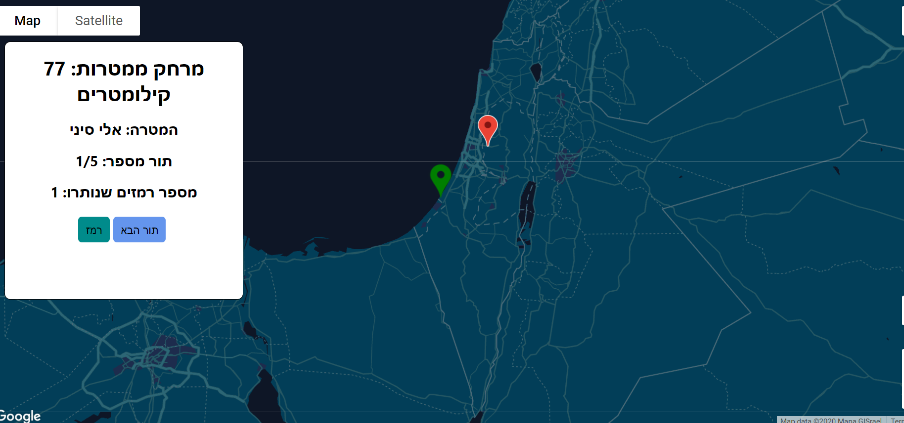
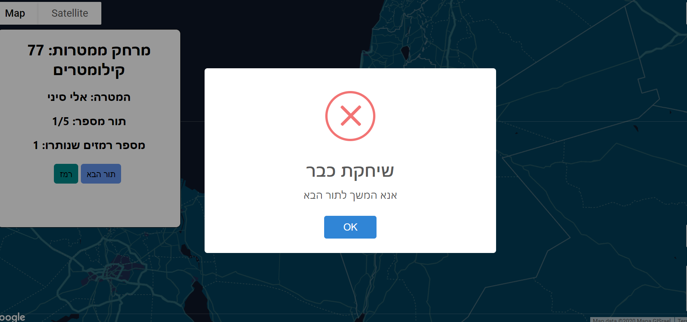
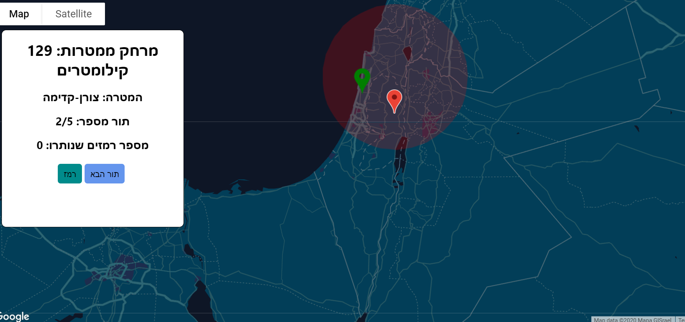

## Map game

This is a simple game made with react and the Google maps API. \
Decided to make this project because i wanted to learn about the Google Maps API, and ended up developing a nice mini game.

In this site you will test your knowledge in the settlements of israel, your score will be graded and the record will be kept for you.

## How To Run

cd to client directory and run npm install, and then run "npm start" to run the app:

```
cd client
npm install
npm start
```

## Game Rules

- In each turn, you will be required to find on the map the location of israeli settlements.
- The distance in km you had from the settlement, will be added to your score.
- You will have 5 turns in total, and you should try and get the **lowest score possible**.
- You also start the game having one clue, and if you succeed in finding the target settlement (20 km or less), you will be given another clue.

 \
 \

